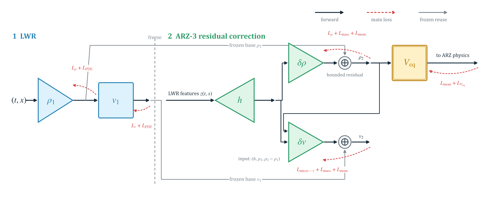

# Physics-informed traffic-state reconstruction on a ring road

This repository reconstructs macroscopic traffic density and velocity from
sparse microscopic probe-vehicle observations. It provides three matched
estimators trained and evaluated on the same periodic SUMO realization:

1. a strictly supervised **Data-driven** baseline;
2. a first-order **LWR physics-informed neural network**;
3. the nested second-order **ARZ-3 residual PINN**.

The repository is intentionally compact: it contains one complete ring-road
dataset, the code required to train and compare the three models, and no
pretrained weights or generated results.

<p align="center">
  
</p>

<p align="center"><em>ARZ-3 reuses a frozen LWR reconstruction and learns coupled density and velocity corrections subject to second-order traffic physics.</em></p>

## Models

| Model | Learned fields | Training information | Physics |
|---|---|---|---|
| Data-driven | Density field and speed-density law | Probe density and microscopic speed only | None |
| LWR | Density field, speed-density law, and probe trajectories | Probe observations and trajectory consistency | First-order conservation law, flux concavity, vanishing viscosity |
| ARZ-3 | Coupled residual corrections and monotone equilibrium speed | Frozen LWR features and the same microscopic probes | Weak mass and momentum balances, global mass, corridor and constitutive constraints |

The Data-driven implementation is genuinely data-only. It creates no
collocation points, trajectory networks, PDE residuals, physics coefficients,
or adaptive physics weights. Its optimized objective contains only the density
and microscopic-speed data terms. The saved metrics include a machine-readable
objective audit.

## Included experiment

The packaged realization is a single-lane periodic ring simulated in SUMO.

| Quantity | Value |
|---|---:|
| Simulation seed | `104827` |
| Probe-selection seed | `209659` |
| Ring length | `6.28208 km` |
| Observation horizon | `40 min` |
| Vehicles | `335` |
| Probe vehicles | `7` |
| Probe penetration | `2.089552%` |
| Spatial cells | `126` |
| Sampling interval | `1 s` |

The training table is `data/steady_ring/pv.csv`. Each headerless row stores:

```text
wrapped position [km], time [min], local normalized density,
microscopic speed [km/min], probe ID, unwrapped cumulative position [km]
```

`spaciotemporal.csv` and `velocity.csv` contain the dense held-out fields used
only for evaluation and plotting. They do not enter the training objectives,
optimizer updates, early stopping, or checkpoint selection. When reconstruction
history is enabled, an isolated callback evaluates these fields diagnostically;
its outputs never propagate gradients into a model.

## Repository layout

```text
data/steady_ring/          one complete SUMO realization and seven probes
docs/architecture.png     computational overview
scripts/
  run_reproduction.py     validate, train all models, and compare them
  train_stage1.py         Data-driven or LWR training
  train_arz3.py           nested ARZ-3 training
  compare_models.py       matched metrics and reconstruction figures
  validate_data.py        structural and numerical data checks
  generate_data.py        optional SUMO regeneration
src/
  data.py                 data loading, interpolation, and metrics
  lwr.py                  Data-driven and LWR model infrastructure
  arz3.py                 coupled ARZ-3 correction model
  baseline.py             exact frozen-LWR restoration
  reconstruction_history.py
  io_utils.py
sumo_config/circle/        periodic SUMO network and route configuration
```

## Installation

Python 3.12 is required. From the repository root:

```bash
python -m venv .venv
```

Activate the environment:

```powershell
# Windows PowerShell
.venv\Scripts\Activate.ps1
```

```bash
# Linux or macOS
source .venv/bin/activate
```

Then install the pinned dependencies:

```bash
python -m pip install --upgrade pip
python -m pip install -r requirements.txt
```

## Reproduce the comparison

First validate the packaged experiment:

```bash
python scripts/validate_data.py
```

Then train all three estimators from scratch and generate their comparison:

```bash
python scripts/run_reproduction.py --seed 3141591
```

The command performs the following pipeline:

```text
validate data
    -> train strictly Data-driven baseline
    -> train LWR PINN
    -> freeze and restore LWR
    -> train ARZ-3 residual correction
    -> compare density and velocity reconstructions
```

By default, held-out reconstruction error is recorded every 250 optimization
steps. Disable that diagnostic history with `--eval-every 0`. Existing outputs
are never reused unless `--reuse` is passed explicitly.

Generated artifacts are written to `results/full/` and are intentionally
ignored by Git. The main comparison outputs include:

- density and velocity reconstruction heatmaps;
- full-plane and probe-band errors;
- density-speed point clouds;
- reconstruction error over optimization;
- per-model metrics and training-objective audits.

## Train a model individually

Strictly Data-driven:

```bash
python scripts/train_stage1.py \
  --config datadriven \
  --data data/steady_ring \
  --outdir results/data_driven \
  --model-seed 3141591 \
  --periodic
```

LWR:

```bash
python scripts/train_stage1.py \
  --config soft-physics \
  --data data/steady_ring \
  --outdir results/lwr \
  --model-seed 3141591 \
  --periodic
```

ARZ-3 requires the freshly trained LWR directory:

```bash
python scripts/train_arz3.py \
  --data data/steady_ring \
  --baseline results/lwr \
  --outdir results/arz3 \
  --seed 3141591
```

## Regenerate the SUMO realization

Training does not require SUMO because the complete experiment is packaged.
To regenerate it, install SUMO, define `SUMO_HOME`, and run:

```bash
python scripts/generate_data.py \
  --out data/generated_seed_104827_probe_209659 \
  --simulation-seed 104827 \
  --probe-seed 209659
```

Generated datasets are ignored by Git so the canonical realization cannot be
overwritten accidentally.

## Reproducibility principles

- The three methods use the same probe observations and held-out reference.
- Training seeds are explicit and all documented commands retrain from scratch.
- No pretrained weights are distributed.
- The Data-driven objective is strictly supervised and audited in its metrics.
- ARZ-3 restores an architecture-recorded, frozen LWR baseline rather than
  relying on an implicit in-memory state.
- Full-plane truth is evaluation-only.

## Research status

This is a curated research implementation accompanying ongoing work on sparse
traffic-state reconstruction. A formal bibliographic citation will be added
when the associated paper is published.
